# 🚀 Secure CI/CD Pipeline on AWS using Terraform, GitHub Actions & Sealed Secrets

This project delivers a production-ready CI/CD pipeline that leverages AWS infrastructure provisioned via Terraform and integrates modern DevSecOps workflows using GitHub Actions. It automates the complete lifecycle from source to deployment, implements infrastructure testing with Terratest, and includes security best practices such as secret encryption via Kubernetes Sealed Secrets and vulnerability scans with tfsec and Trivy.

---

## 🧱 Modern DevSecOps Architecture Overview

```mermaid
flowchart TD
  direction TB

  subgraph Developer
    A["🧑‍💻 Push to GitHub"]
  end

  subgraph GitHub Actions
    B1["⚙️ CI Workflow"]
    B2["🧪 tfsec Scan"]
    B3["🔍 Trivy Scan"]
    B4["🔐 Seal Secrets"]
  end

  subgraph AWS Infrastructure
    C1["📦 S3 Bucket"]
    C2["🛠️ CodeBuild"]
    C3["🚀 CodeDeploy"]
    C4["🔁 CodePipeline"]
    C5["🔐 IAM Roles"]
  end

  subgraph Kubernetes Cluster
    D1["🧩 Sealed Secrets Controller"]
    D2["☸️ Deployments"]
  end

  A --> B1 --> B2 & B3 & B4 --> C4 --> C1 & C2 & C3 & C5
  C3 --> D2
  B4 --> D1 --> D2
```




## 🔑 Key Highlights

- **Infrastructure as Code** with Terraform to automate AWS resource provisioning.
- **CI/CD Workflow** managed by GitHub Actions.
- **Security First** with `tfsec` and `Trivy` for IaC and container scanning.
- **Encrypted Secrets** using Kubernetes Sealed Secrets.
- **Robust Testing** using Terratest for infrastructure validation.

---

## 🧰 Tools & Technologies

| Layer            | Tools/Services                                           |
|------------------|----------------------------------------------------------|
| IaC              | Terraform, Terratest                                     |
| Cloud Platform   | AWS (CodePipeline, CodeBuild, CodeDeploy, S3, IAM)       |
| DevSecOps        | tfsec, Trivy                                              |
| CI/CD            | GitHub Actions                                           |
| Containers       | Docker, Kubernetes                                       |
| Secret Handling  | Sealed Secrets                                           |
| Languages        | YAML, Go                                                 |

---

## ⚙️ Setup Instructions

### Step 1: Clone the Repository
```bash
git clone https://github.com/yourusername/DevOps-Masters-Project.git
cd DevOps-Masters-Project
```

### Step 2: AWS CLI Configuration
```bash
aws configure
```

### Step 3: Install Terraform
Refer to [Terraform Docs](https://developer.hashicorp.com/terraform/downloads) for installation.

### Step 4: Create `terraform.tfvars`
```hcl
project_name       = "myApp"
bucket_name        = "your-unique-artifact-bucket-name"
aws_region         = "your-region"
ami_id             = "ami-xxxx"
instance_type      = "t3.micro"
key_name           = "your-key"
github_owner       = "your-user"
github_repo        = "your-repo"
github_branch      = "main"
github_token       = "ghp_xxx"
instance_tag_key   = "Name"
instance_tag_value = "AppServer"
```

### Step 5: Deploy Infrastructure
```bash
terraform init
terraform apply --auto-approve
```

> ⚠️ Don't commit `terraform.tfvars` to version control.

---

## 🛠️ How It Works

### 📦 Part 1: AWS Infrastructure Provisioning

- **Terraform** provisions:
  - S3 bucket for artifacts
  - IAM roles
  - CodePipeline (GitHub Source -> Build -> Deploy)
  - CodeBuild and CodeDeploy resources

- **Terratest** ensures infrastructure integrity.

### 📁 Required Files in App Repo
- `buildspec.yml`: for CodeBuild
- `appspec.yml`: for CodeDeploy
- `scripts/install.sh` and `scripts/start.sh`: setup & run app

### ✅ Run Terratest
```bash
go mod init devops-test
go get github.com/gruntwork-io/terratest/modules/terraform
```

`test/terraform_pipeline_test.go` should include:
```go
terraform.InitAndApply(t, options)
assert.NotEmpty(t, terraform.Output(t, options, "codepipeline_name"))
```

---

### 🔒 Part 2: DevSecOps with GitHub Actions

#### a. tfsec + Terraform Validation
```yaml
jobs:
  validate:
    steps:
      - uses: actions/checkout@v3
      - uses: hashicorp/setup-terraform@v2
      - run: terraform validate
      - uses: aquasecurity/tfsec-action@v1.0.0
```

#### b. Docker Build + Trivy Scan
```yaml
jobs:
  scan:
    steps:
      - run: docker build -t app:latest .
      - run: trivy image app:latest
```

#### c. Sealed Secrets CLI
```bash
kubectl create secret generic creds --from-literal=key=value -o yaml > secret.yaml
kubeseal --cert cert.pem < secret.yaml > sealed-secret.yaml

```

---

## 📂 File Layout

```
DevOps-Masters-Project/
├── .github/workflows/
│   └── devsecops-pipeline.yml
├── terraform/
│   ├── main.tf
│   ├── variables.tf
│   └── outputs.tf
├── Dockerfile
├── kubernetes/
│   ├── deployment.yaml
│   └── secrets/
│       └── mysecret.yaml
├── examples/ # Contains buildspec.yml, appspec.yml, scripts for application
├── test/     # Terratest files
│   └── terraform_pipeline_test.go
├── .gitignore
├── README.md
├── main.tf
└── terraform.tfvars

```

---

## 🧪 GitHub Actions Pipeline Summary

- Code pushed → triggers CI.
- Terraform validated and scans.
- Docker image built and scans.
- Secrets encrypted & applied to cluster.
- App deployed to Kubernetes.

---

## 💬 Contributions Welcome!

1. clone locally  
2. Create a new branch
3. Commit your changes
4. Push and raise PR 🚀


